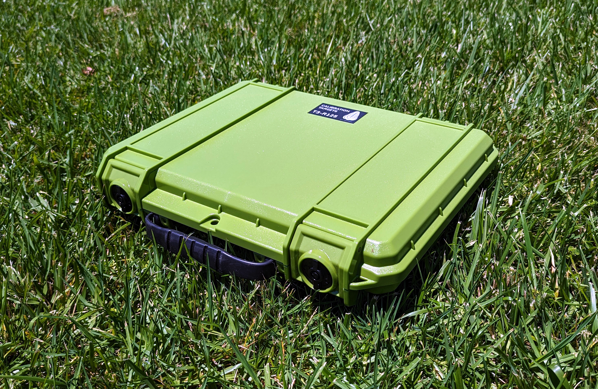

# Калибрационни мишени

MAPIR предлага различни калибрационни мишени, подходящи за широк спектър от приложения. Компактният модел T4-R50, показан по-долу, съдържа 4 панела, чието светлинно отражение е измерено в диапазона от 250 до 2 500 nm.

<figure><figcaption>
MAPIR T4-R50
</figcaption></figure>Дифузните еталонни мишени T4 имат следните криви на отражателната способност, [изтегляне на данни тук](https://cdn.shopify.com/s/files/1/0972/5566/files/MAPIR_Diffuse_Reflectance_Standard_Calibration_Target_Data_T4.xlsx?v=1741759157):

<figure><figcaption>
MAPIR Отражателна способност на T4 :: 250–2500 nm
</figcaption></figure>

<figure><figcaption>
MAPIR Отражателна способност на T4 :: 400–1000 nm
</figcaption></figure>Дифузните еталонни мишени T4P имат следните криви на отражателната способност, [изтеглете данните тук](https://cdn.shopify.com/s/files/1/0972/5566/files/MAPIR_Diffuse_Reflectance_Standard_Calibration_Target_Data_T4.xlsx?v=1741759157):

<figure><figcaption>
MAPIR T4P отражателна способност :: 250–2500 nm
</figcaption></figure>

<figure><figcaption>
MAPIR T4P отражателна способност :: 400–1000 nm
</figcaption></figure>Като разгледате графиката на отражателната способност, ще видите, че стойностите представят дължината на вълната (ос х) спрямо процента на отражателната способност (ос у). Когато заснемем изображение на калибрационната мишена, създаваме връзка между стойността на пиксела и процента на отражателната способност в рамките на спектъра, към който е чувствителна всяка от сензорните ленти на камерата.

Това означава, че с всяко изображение, което заснемете с нашите камери, можете да използвате снимка на нашите еталони за отражателна способност, като например [T4-R50](https://www.mapir.camera/collections/calibration-targets/products/diffuse-reflectance-standard-calibration-target-package-t3-r50) или [T4-R125](https://www.mapir.camera/collections/multispectral-reflectance-reference-calibration-targets/products/diffuse-reflectance-standard-calibration-target-package-t4-r125), за да калибрирате изображенията по отношение на отражателната способност. След калибрирането всеки пиксел в изображението съответства на процента на отражателната способност.

За **Survey3** , ако изведете калибрираните изображения в Chloros като стандартен JPG или TIFF, процентът на отражателната способност се изчислява, като стойността на пиксела се раздели на битовата дълбочина на формата на изображението. Така че за JPG се разделя на 255, а за TIFF – на 65 535. Можете също да изберете изходния формат PERCENT в Chloros, като тогава всеки пиксел ще варира в диапазона от 0,0 до 1,0 (0% до 100% отражателна способност). Само имайте предвид, че някои приложения за изображения не поддържат изображения в проценти (с плаваща запетая) и те заемат много място при съхранение.


**Отражателната способност на LATTICE използва различен мащаб на пикселите.** Отражателната способност на LATTICE се съхранява с DN 32768 = 100% отражателна способност (а не 65535), а всеки файл съдържа XMP таг `Chloros:PixelScale`, който посочва неговия мащаб. Прочетете тага и разделете с него, вместо да приемате, че мащабът е постоянен — вижте [Формати на изходните изображения](output-image-formats.md).


## Калибрационни мишени с камери LATTICE

При камерите LATTICE калибрационната мишена е **незадължителна** за отражателната способност: Chloros може вместо това да отнася отражателната способност към низходящата интензивност на излъчването, измерена от светлинен сензор DAQ (ρ = π·L/E). Референцията се избира чрез настройката за източника на отражателна способност (Настройки на проекта в графичния интерфейс; `--reflectance-source` в CLI; `reflectance_source` в SDK):

| Стойност | Поведение |
| --- | --- |
| `auto` *(по подразбиране)* | Целта в кадъра, преминала QA, е **абсолютната референция**; когато няма цел или QA се провали, Chloros преминава към разделянето на низходящия поток на DAQ. |
| `target` | Изключително по целта — без заместване от DAQ. |
| `daq` | DAQ има предимство — измерването на низходящия поток винаги е референцията. |

Допълнително поведение на целите за LATTICE:

* **Геометрии на целите** — Поддържат се панели, маркирани с ArUco, панели с фиксирана област на интерес (ROI) и лентови цели; геометрията се взема от конфигурацията на целите в проекта.
* **Данни за измерени цели по единици** — `--target-reflectance-dir DIR` сочи към директория със сканирани данни за отражателната способност на измерените цели по единици (`<serial>.csv`, търсени по серийния номер/QR кода на единицата на целта). При пропуск Chloros преминава към номиналните T3/T4P спектри.
* **Временно закрепване** — открита цел калибрира кадрите около нея и се запазва между наблюденията на целта.

Пълната семантика на флаговете и примерите са в [CLI Справочник](reference/cli-reference.md) (вижте „Превключватели за експортиране по продукти“).

### F988

„Отражателната способност на F988 се калибрира с помощта на панел за отражателна способност в кадъра: лентата се намира извън калибрирания обхват на светлинния сензор на DAQ, така че Chloros прилага най-скорошния ви запис от панела и го запазва между наблюденията на панела.“

Ако F988 се изпълнява с калибриране само чрез DAQ, Chloros отхвърля рефлектанса, базиран на DAQ, за тази лента и посочва причината (причина за пропускане `dls-uncalibrated-band-988`); работният процес с панела е поддържаният начин.

<figure><figcaption>
T4-R125
</figcaption></figure> <figure><figcaption>
T4-R125
</figcaption></figure> <figure><figcaption>
T4-R125
</figcaption></figure>

